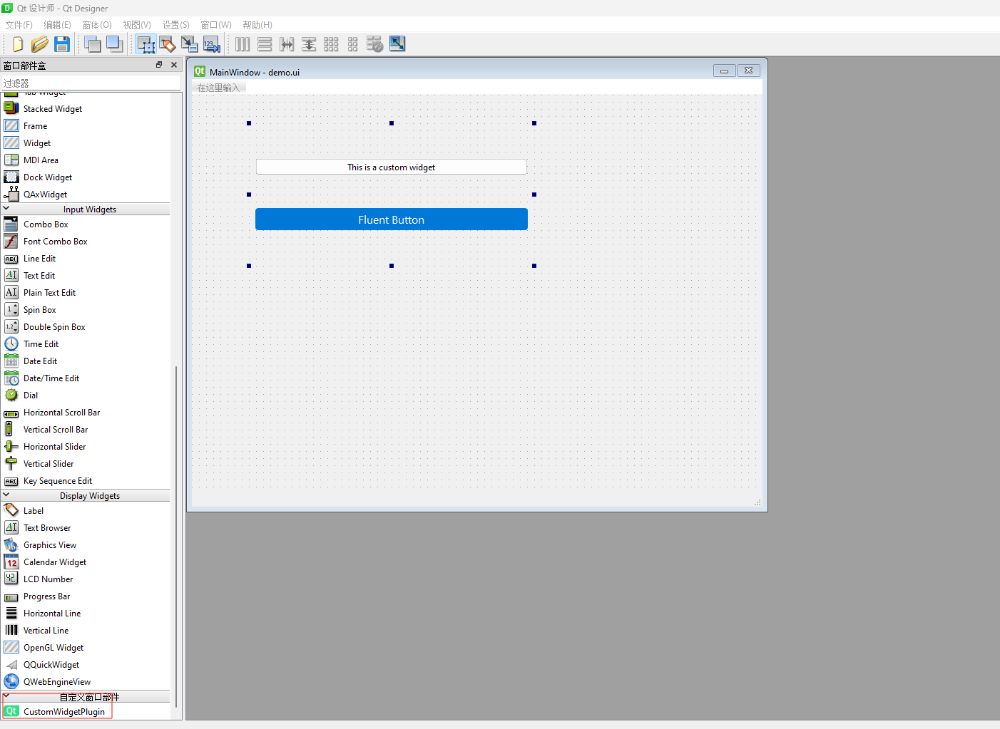

[参考]: https://doc.qt.io/qtforpython-6.5/tutorials/basictutorial/uifiles.html#custom-widgets-in-qt-designer


# 准备自定义组件

```python

# CustomWidgetPlugin.py
from PySide6.QtWidgets import QWidget, QLabel, QVBoxLayout, QPushButton
from PySide6.QtCore import Qt


class CustomWidgetPlugin(QWidget):
    def __init__(self, parent=None):
        super().__init__(parent)
        self.index = 0
        layout = QVBoxLayout(self)
        label = QPushButton("This is a custom widget", self)
        layout.addWidget(label)

        # Create the button
        self.button = QPushButton("Fluent Button", self)
        layout.addWidget(self.button)
        self.button.setGeometry(50, 50, 200, 50)

        # Apply Fluent-like style
        self.button.setStyleSheet("""
                    QPushButton {
                        background-color: #0078D7;     /* Fluent blue */
                        color: white;
                        border: none;
                        border-radius: 4px;
                        padding: 5px;
                        font-size: 16px;
                    }
                    QPushButton:hover {
                        background-color: #0063B1;     /* Hover effect */
                    }
                    QPushButton:pressed {
                        background-color: #005A9E;     /* Pressed effect */
                    }
                    QPushButton:disabled {
                        background-color: #F3F3F3;     /* Disabled effect */
                        color: #A6A6A6;
                    }
                """)

        self.setLayout(layout)
        self.button.clicked.connect(self.slotClicked)

    def slotClicked(self):
        print(self.index, 'button index')
        self.index += 1

```

# 注册自定义组件

> 命名约定：register*.py， *是组件名

```python
# registerCustomWidgetPlugin.py

from PySide6.QtDesigner import QPyDesignerCustomWidgetCollection


import QtDesigner

from CustomWidgetPlugin import CustomWidgetPlugin

TOOLTIP = "A cool CustomWidgetPlugin (Python)"
DOM_XML = """
<ui language='c++'>
    <widget class='CustomWidgetPlugin' name='CustomWidgetPlugin'>
        <property name='geometry'>
            <rect>
                <x>0</x>
                <y>0</y>
                <width>400</width>
                <height>200</height>
            </rect>
        </property>
        <property name='text'>
            <string>Hello, world</string>
        </property>
    </widget>
</ui>
"""

QPyDesignerCustomWidgetCollection.registerCustomWidget(CustomWidgetPlugin, module="CustomWidgetPlugin",
                                                       tool_tip=TOOLTIP, xml=DOM_XML)

```


# 设置环境变量

```shell
PYSIDE_DESIGNER_PLUGINS=E:\studyProject\customFluentWidget
```


# 重新启动电脑

