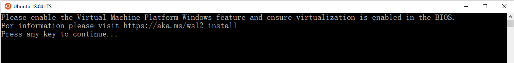
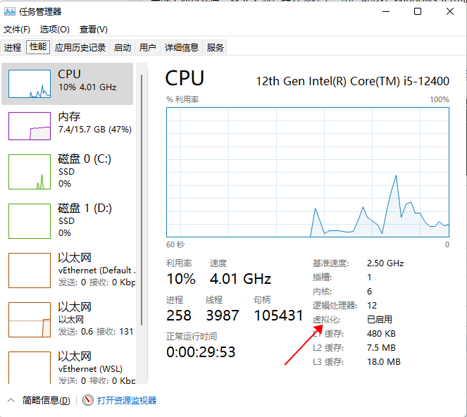
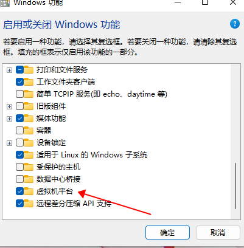
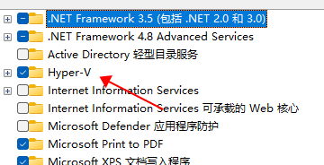
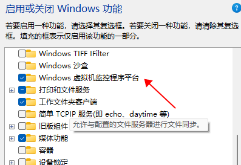

# 简介

WSL (Windows Subsystem for Linux) 是 Windows 操作系统中的一个功能，它允许用户在 Windows 中运行 Linux 环境。WSL 的存在使得 Windows 用户可以使用 Linux 的工具和命令行界面，而无需在系统中安装另一个操作系统或虚拟机。
使用 WSL，用户可以在 Windows 操作系统上运行各种 Linux 应用程序、工具和开发环境，如 Bash、vim、git、Node.js、Docker 等等。WSL 可以帮助 Windows 用户更加方便地进行开发、测试和部署，也让他们更容易地获得 Linux 的强大功能和灵活性，而无需离开 Windows 系统。

现在我想安装wsl主要是为了使用linux的`rm`命令，可以很方便的删除文件，window的删除文件功能太慢了。

# WSL2 安装步骤

接下来简单说一下wsl的安装步骤：

1. 在 Windows 10 系统的“控制面板”中，点击“程序和功能”，然后点击“启用或关闭 Windows 功能”。
2. 勾选“适用于 Linux 的 Windows 子系统”（Windows Subsystem for Linux）选项，点击“确定”并等待安装完成。
3. 在 Microsoft Store 中搜索并下载适用于 WSL 2 的 Linux 发行版，例如 Ubuntu、Debian 或 Fedora。
4. 打开 Windows Terminal 或命令提示符，运行以下命令启用 WSL 2：


```bash
dism.exe /online /enable-feature /featurename:VirtualMachinePlatform /all /norestart
```

1. 在 Microsoft Store 中下载并安装适用于 WSL 2 的 Linux 内核更新包。
2. 运行以下命令设置 WSL 2 为默认版本：


```bash
wsl --set-default-version 2
```

1. 运行以下命令以在 WSL 2 中安装所需的 Linux 发行版：


```bash
wsl --install -d <DistributionName>
```

其中， 是要安装的 Linux 发行版的名称，例如 Ubuntu、Debian 或 Fedora。

# 遇到问题及处理问题

根据上面的步骤，我启用了wsl2，也在应用商店中安装了ubuntu，但是在启用ubuntu的时候却出现了问题。
[](https://img2023.cnblogs.com/blog/1115733/202303/1115733-20230311145004373-1557919507.png)
上面这张图片就是遇到的问题，提醒`Please enable the Virtual Machine Platform Windows feature and ensure virtualization is enabled in the BIOS`。
意思是我需要开启`虚拟机平台`，并且在bios中开启`虚拟化功能`。

但是我去检查的时候发现这两个条件我已经完成了，可以在任务管理器查看是否开启了虚拟化功能：
[](https://img2023.cnblogs.com/blog/1115733/202303/1115733-20230311150052549-1834894873.png)
功能里面也勾选了虚拟机平台：
[](https://img2023.cnblogs.com/blog/1115733/202303/1115733-20230311150142261-1748340718.png)
这样报错就很不合理了。

之后我在网络寻求解决方案，说是是需要开启功能hyper-v。

> 问题解决方案来自：https://blog.csdn.net/qq_39757730/article/details/117431647

于是我开启了hyper-v功能和虚拟机监控程序平台。
[](https://img2023.cnblogs.com/blog/1115733/202303/1115733-20230311150512535-1897527117.png)
[](https://img2023.cnblogs.com/blog/1115733/202303/1115733-20230311150528934-1910899608.png)

再次启动wsl ubuntu系统，wsl成功启动。

# 再次无法启动wsl

过了一段时间wsl无法开启，发现`hyper-v`和`虚拟机监控程序平台功能`被取消掉，怀疑可能是安装了虚拟机软件造成的。
于是再次勾选`hyper-v`和`虚拟机监控程序平台功能`两个选项，重启后发现还是无法开启wsl。
于是网上找方法，执行下面的命令：


```bash
bcdedit /set hypervisorlaunchtype auto
```

然后重启电脑后wsl正常使用。

# 总结

1. 在bios中开启虚拟化支持，可以搜索相关主板的操作方法。
2. 在`启动和关闭windows功能`中启用`hyper-v`和`虚拟机监控程序平台功能`。
3. 安装一些软件比如android模拟器，可能会导致虚拟话功能关闭，执行`bcdedit /set hypervisorlaunchtype auto`解决。