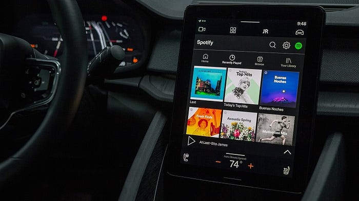
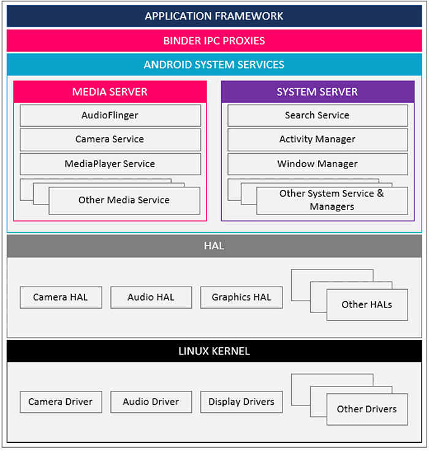

## Introduction:

The automotive industry is buzzing with excitement as Google’s Android Automotive OS takes the wheel. This sophisticated operating system is designed to elevate your driving experience to a whole new level — safe, connected, and entertaining.

Discover how car manufacturers worldwide are embracing Android Automotive OS. Some have already teamed up with Google to create state-of-the-art infotainment systems, powered by Google Automotive Services (GAS). Others are exploring the open-source AOSP with car extensions to craft their very own Android Automotive System.

Lets dive deep and shed light on some of the more technical aspects of Google’s Android Automotive OS.

## Feature Overview:

In order to understand the individual components and the added value of the operating system, we want to give a brief overview of its structure.

​																					Figure: Abstract layer architecture of Android Automotive

**OEM and 3rd party** applications as a set of Android applications including the **HMI and application background services** in the /product partition.

**Android Open Source Project (AOSP).** Include all the GIT-tree packages from the generic system applications, the application framework, system services through the HAL interfaces and should be in the /system partition.

**Board Support Package (BSP).** Includes the Linux kernel image with the HAL implementation for given hardware. The BSP is System on the Chip (SoC) dependent and part of the /vendor partition.

## Google Automotive Services (GAS):

GAS describes a set of customer-specific and technical services that are pre-compiled by Google and provided through a licensing model. Following are the most important services;

- **Google Maps & Navigation:** For navigation from point A to point B with intelligent address, route, petrol station and charging station search.
- **Google Assistant:** Voice personal assistant for controlling various vehicle functionalities (can be extended) or give additional information to the user.
- **Google Playstore:** Provision and management of 3rd party applications that are tailored to be used in the vehicle.
- **SetupWizard:** Creation of vehicle user profile accounts and connectivity setup.
- **Automotive Keyboard:** A keyboard adapted for the automotive industry to operate the touchscreen and support various languages.

The OEM receives access to GAS through an associated partnership with Google. This provides access to close communication & support, extended technical documentation as well as the quarter pre-release (QPR) versions with new updates and upgrades.

Non-GAS describes a platform version that does not require the integration of GAS. The OEM simply downloads the freely available AOSP source code with car extensions and integrates its own applications and services.

Besides GAS, following are the Here Applications Google developed.

- **Media Center:** Skeleton for the integration of media sources such as the *LocalMediaPlayer*. The skeleton is fully integrated and interacts seamlessly with the Notification center and the Dialer.
- **Dialer:** The central telephone application, which allows the contacts of the connected smartphone to be managed and calls to be made.
- **Car Settings:** Management of various system settings such as Time & Languages, User Management and Connectivity.
- **Notification Center:** Brief system- notifications for the user and interactions to start applications.

## Frameworks & Libraries:

**UI Frameworks** The *SystemUI / CarSystemUI* manage the general structure of the central screen. The user can customize these if necessary and change the individual fragments of the bars and their content (e.g. *StatusBar* at the top of the screen, global *NavigationBar* at the bottom as well as main fragment and *HVAC bar*). Furthermore, the OEM/Tier 1 can manage the theming (use of colors, fonts and styles) and the display of pop-ups via the *SystemUI*.

**CarInfoManager:** Depending on the development strategy, the OEM may want to manage multiple vehicle variants with one platform version. The *CarInfoManager* can be used to dynamically adapt the HMI. As a proxy component, this provides the static information regarding the vehicle model, variant and other relevant vehicle properties.

**CarPowerManager:** The behaviour of the infotainment system and its applications largely depends on the system state of the vehicle. These communicate via the *CarPowerManager* with the *Vehicle HAL* and the *Vehicle Microcontroller Unit (VMCU)* based on a generic state machine.

**CarProjectionManager:** The efficient integration and handling of different projection technologies is a key requirement for today’s infotainment systems. The user should be free to choose between Android Auto, Apple CarPlay or other mirroring technologies. With *CarProjectionManager*, Google enables the development of an application that guarantees the same system behaviour when establishing a connection, managing smartphones and closing the connection.

## Android Automotive OS Architecture:

The Android platform (AOSP) can be generically divided into the components displayed in figure below. Those are,

- Application framework and applications
- Android Automotive system service and Binder IPC
- Hardware Abstraction Layer
- Linux Kernel

Figure: Android System Architecture

**Application Framework:** Commonly called the “HMI Layer”, the Application Framework contains the system and user applications. The best practice is to design the applications in such a way that they are only responsible for the visualisation incl. small calculations to not block the *MainUI* thread and more the core business logic to the System Services in the Service Layer. Furthermore, applications manage their own translation labels and notifications using background services.

**Service Layer:** System services are included in the Service Layer and started by the *SystemServer.* They run as a System process which gives them additional privileges that normal Android Services do not have. This approach provides an opportunity for OEMs to develop other applications, that can use the service without source code duplication. Furthermore, OEMs can use the services as an additional layer for security reasons to avoid direct communication between the applications and the Hardware Abstraction Layer.

**Vehicle HAL:** The role of the Vehicle HAL is to expose car-specific interfaces to the system services, in an extendable, vehicle-agnostic manner. These interfaces include

- Access to signals to / from the ECUs(e.g. Brake control module, Engine control module, Suspension control module) in the vehicle
- Access to signals generated from the vehicle microcontroller unit to the IVI OS
- Access to service-oriented functions available on the vehicle network (e.g.: SOME-IP)

## Summary:

We consider Android Automotive an effective platform that includes all necessary core features. It requires lower development-, integration- and maintenance-cost for connected infotainment systems. The system can be fully customized, however any deviation from the original source code increases the OEM’s development and maintenance effort. Another benefit is that Google will release regular patches and annual major upgrades with added features, extended functionalities and other improvements.
