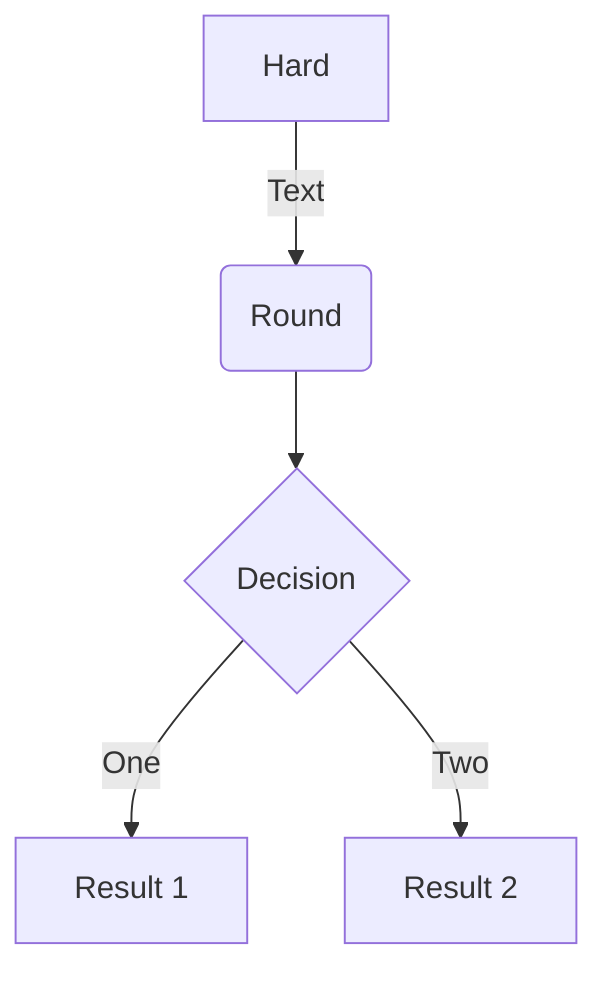
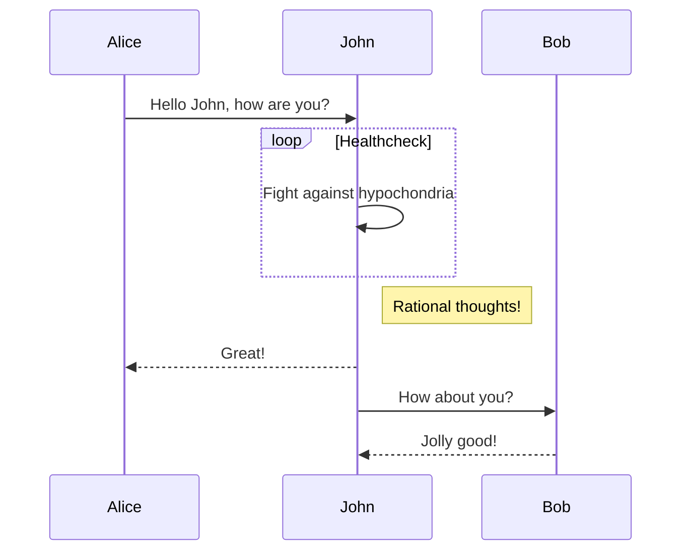
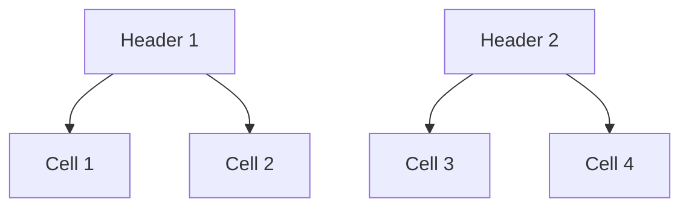
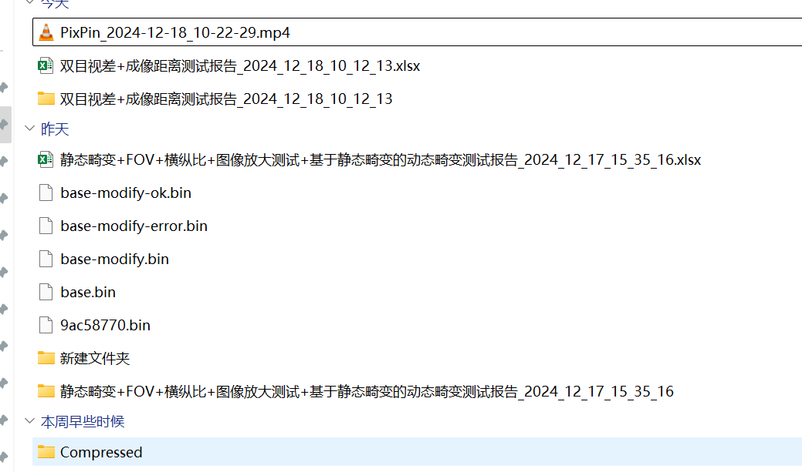

# Markdown 全面特性测试
## Custom containers

::: warning
*here be dragons*
:::

This is to display the `$$c = \pm\sqrt{a^2 + b^2}$$`  in one line

```KaTeX
c = \pm\sqrt{a^2 + b^2}
```

The following are some examples of the diagrams, charts and graphs that can be made using Mermaid and the
Markdown-inspired text specific to it.


<div data-caption='table' style="display: flex; justify-content: center; margin-bottom: 24px">大范围发我个</div>


| A1  | B1  | C1  | D1  | E1  | F1  |
|-----|-----|-----|-----|-----|-----|
| >   | A2  | C2  | D2  | E2  | F2  |
| A3  | B3  | C3  | ^   | E3  | F3  |
| >   | >   | >   | \>  | E4  | F4  |
| A5  | B5  | C5  | D5  | E5  | F5  |
| A6  | B6  | C6  | ^   | E6  | F6  |
| A7  | B7  | C7  | ^   | E7  | F7  |
| A8  | >   | B8  | ^   | E8  | F8  |
| A9  | ^   | ^   | ^   | \>  | F9  |
| A10 | ^   | ^   | ^   | >   | E10 |
| A11 | ^   | ^   | ^   | ^   | ^   |
| A12 | ^   | ^   | ^   | E12 | F12 |
| A13 | ^   | ^   | ^   | >   | E13 |
| A14 | B14 | C14 | ^   | E14 | F14 |
| A15 | B15 | C15 | ^   | E15 | ^   |
| A16 | B16 | \>  | D16 | E16 | ^   |
| A17 | B17 | C17 | D17 | E17 | ^   |
| >   | >   | >   | A18 | E18 | \>  |
| ^   | ^   | ^   | ^   | ^   | F19 |
| A20 | B20 | C20 | D20 | ^   | F20 |

| 点位 | 基准位置                                           | 相对位置                                            | 以130*50眼盒举例 | 以100*30眼盒举例 |
|----|------------------------------------------------|-------------------------------------------------|-------------|-------------|
| O  | 基于平移台设定的绝对位置     可作为配置项     设定项包括X、Y、Z、偏航角、俯仰角 | /                                               | X0          | X0          |
| ^  | ^                                              | ^                                               | Y0          | Y0          |
| ^  | ^                                              | ^                                               | Z0          | Z0          |
| A  | /                                              | 可作为勾选项     以O点为基准的相对位置     可作为配置项目     设定项包括Y、Z | Y=Y0-65     | Y=Y0-50     |
| ^  | ^                                              | ^                                               | Z=Z0+25     | Z=Z0+15     |
| B  | /                                              | 可作为勾选项     以O点为基准的相对位置     可作为配置项目     设定项包括Y、Z | Y=Y0        | Y=Y0        |
| ^  | ^                                              | ^                                               | Z=Z0+25     | Z=Z0+15     |
| C  | /                                              | 可作为勾选项     以O点为基准的相对位置     可作为配置项目     设定项包括Y、Z | Y=Y0+65     | Y=Y0+50     |
| ^  | ^                                              | ^                                               | Z=Z0+25     | Z=Z0+15     |
| D  | /                                              | 可作为勾选项     以O点为基准的相对位置     可作为配置项目     设定项包括Y、Z | Y=Y0-65     | Y=Y0-50     |
| ^  | ^                                              | ^                                               | Z=Z0        | Z=Z0        |
| E  | /                                              | 可作为勾选项     以O点为基准的相对位置     可作为配置项目     设定项包括Y、Z | Y=Y0+65     | Y=Y0+50     |
| ^  | ^                                              | ^                                               | Z=Z0        | Z=Z0        |
| F  | /                                              | 可作为勾选项     以O点为基准的相对位置     可作为配置项目     设定项包括Y、Z | Y=Y0-65     | Y=Y0-50     |
| ^  | ^                                              | ^                                               | Z=Z0-25     | Z=Z0-15     |
| G  | /                                              | 可作为勾选项     以O点为基准的相对位置     可作为配置项目     设定项包括Y、Z | Y=Y0        | Y=Y0        |
| ^  | ^                                              | ^                                               | Z=Z0-25     | Z=Z0-15     |
| H  | /                                              | 可作为勾选项     以O点为基准的相对位置     可作为配置项目     设定项包括Y、Z | Y=Y0+65     | Y=Y0+50     |
| ^  | ^                                              | ^                                               | Z=Z0-25     | Z=Z0-15     |
| K  | /                                              | 可作为勾选项     以O点为基准的相对位置     可作为配置项目     设定项包括Y、Z | Y=Y0-33     | Y=Y0-33     |
| ^  | ^                                              | ^                                               | Z=Z0+25     | Z=Z0+15     |
| L  | /                                              | 可作为勾选项     以O点为基准的相对位置     可作为配置项目     设定项包括Y、Z | Y=Y0+33     | Y=Y0+33     |
| ^  | ^                                              | ^                                               | Z=Z0+25     | Z=Z0+15     |
| I  | /                                              | 可作为勾选项     以O点为基准的相对位置     可作为配置项目     设定项包括Y、Z | Y=Y0-33     | Y=Y0-33     |
| ^  | ^                                              | ^                                               | Z=Z0        | Z=Z0        |
| J  | /                                              | 可作为勾选项     以O点为基准的相对位置     可作为配置项目     设定项包括Y、Z | Y=Y0+33     | Y=Y0+33     |
| ^  | ^                                              | ^                                               | Z=Z0        | Z=Z0        |
| M  | /                                              | 可作为勾选项     以O点为基准的相对位置     可作为配置项目     设定项包括Y、Z | Y=Y0-33     | Y=Y0-33     |
| ^  | ^                                              | ^                                               | Z=Z0-25     | Z=Z0-15     |
| N  | /                                              | 可作为勾选项     以O点为基准的相对位置     可作为配置项目     设定项包括Y、Z | Y=Y0+33     | Y=Y0+33     |
| ^  | ^                                              | ^                                               | Z=Z0-25     | Z=Z0-15     |
| A1 | /                                              | 可作为勾选项     以O点为基准的相对位置     可作为配置项目     设定项包括Y、Z | Y=Y0        | Y=Y0+16     |
| ^  | ^                                              | ^                                               | Z=Z0+25     | Z=Z0+15     |
| C1 | /                                              | 可作为勾选项     以O点为基准的相对位置     可作为配置项目     设定项包括Y、Z | Y=Y0        | Y=Y0-16     |
| ^  | ^                                              | ^                                               | Z=Z0+25     | Z=Z0+15     |
| D1 | /                                              | 可作为勾选项     以O点为基准的相对位置     可作为配置项目     设定项包括Y、Z | Y=Y0        | Y=Y0+16     |
| ^  | ^                                              | ^                                               | Z=Z0        | Z=Z0        |
| E1 | /                                              | 可作为勾选项     以O点为基准的相对位置     可作为配置项目     设定项包括Y、Z | Y=Y0        | Y=Y0-16     |
| ^  | ^                                              | ^                                               | Z=Z0        | Z=Z0        |
| F1 | /                                              | 可作为勾选项     以O点为基准的相对位置     可作为配置项目     设定项包括Y、Z | Y=Y0        | Y=Y0+16     |
| ^  | ^                                              | ^                                               | Z=Z0-25     | Z=Z0-15     |
| H1 | /                                              | 可作为勾选项     以O点为基准的相对位置     可作为配置项目     设定项包括Y、Z | Y=Y0        | Y=Y0-16     |
| ^  | ^                                              | ^                                               | Z=Z0-25     | Z=Z0-15     |

| header1          | header2          |
|------------------|------------------|
| cell (rowspan=2) | cell             |
| ^                | cell             |
| >                | cell (colspan=2) |
| escape >         | \>               |
| escape ^         | \^               |

---
__Advertisement :)__

- __[pica](https://nodeca.github.io/pica/demo/)__ - high quality and fast image
  resize in browser.
- __[babelfish](https://github.com/nodeca/babelfish/)__ - developer friendly
  i18n with plurals support and easy syntax.

You will like those projects!

---

# h1 Heading 8-)458489498


## h2 Heading

## h2 Heading

### h3 Heading

#### h4 Heading

##### h5 Heading

###### h6 Heading

## Horizontal Rules

___

---

***

## Typographic replacements

Enable typographer option to see result.

(c) (C) (r) (R) (tm) (TM) (p) (P) +-

test.. test... test..... test?..... test!....

!!!!!! ???? ,, -- ---

"Smartypants, double quotes" and 'single quotes'

## Emphasis

**This is bold text**

__This is bold text__

*This is italic text*

_This is italic text_

~~Strikethrough~~

## Blockquotes

> Blockquotes can also be nested...
> > ...by using additional greater-than signs right next to each other...
> >
> > > ...or with spaces between arrows.

## Lists

Unordered

+ Create a list by starting a line with `+`, `-`, or `*`
+ Sub-lists are made by indenting 2 spaces:
    - Marker character change forces new list start:
        * Ac tristique libero volutpat at

        + Facilisis in pretium nisl aliquet

        - Nulla volutpat aliquam velit
+ Very easy!

Ordered

1. Lorem ipsum dolor sit amet
2. Consectetur adipiscing elit
3. Integer molestie lorem at massa


1. You can use sequential numbers...
1. ...or keep all the numbers as `1.`

Start numbering with offset:

57. foo
1. bar

## Code

Inline `code`

Indented code

    // Some comments
    line 1 of code
    line 2 of code
    line 3 of code

Block code "fences"

```
Sample text here...
```

Syntax highlighting

``` js
var foo = function (bar) {
  return bar++;
};

console.log(foo(5));
```

## Tables

| Option | Description                                                                                                     |
|--------|-----------------------------------------------------------------------------------------------------------------|
| data   | path to data files to supply the data that will be passed into templates.                                       |
| engine | engine to be used for processing templates. Handlebars is the sdfgdfgfsdgfs    sdfgsdfgsdf  sgfsfdgsdf default. |
| ext    | extension to be used for dest files.                                                                            |

Right aligned columns

| Option |                         Description                          |
| :----: | :----------------------------------------------------------: |
|  data  | path to data files to supply the data that will be passed into templates. |
| engine | engine to be used for processing templates. Handlebars is the default. |
|  ext   |             extension to be used for dest files.             |

## Links

[link text](http://dev.nodeca.com)

[link with title](http://nodeca.github.io/pica/demo/ "title text!")

Autoconverted link https://github.com/nodeca/pica (enable linkify to see)

## Images


Like links, Images also have a footnote style syntax

![Alt text][id]

With a reference later in the document defining the URL location:

[id]: https://octodex.github.com/images/dojocat.jpg  "The Dojocat"

## Plugins

The killer feature of `markdown-it` is very effective support of
[syntax plugins](https://www.npmjs.org/browse/keyword/markdown-it-plugin).

### Emojies

> Classic markup: :wink: :cry: :laughing: :yum:
>
> Shortcuts (emoticons): :-) :-( 8-) ;)

### Subscript

- 19^th^
- H~2~O

### ins

++Inserted text++

### mark

==Marked text==

### Definition lists

Term 1

:   Definition 1
with lazy continuation.

Term 2 with *inline markup*

:   Definition 2

        { some code, part of Definition 2 }
    
    Third paragraph of definition 2.

_Compact style:_

Term 1
~ Definition 1

Term 2
~ Definition 2a
~ Definition 2b

### Abbreviations

This is HTML abbreviation example.

It converts "HTML", but keep intact partial entries like "xxxHTMLyyy" and so on.

*[HTML]: Hyper Text Markup Language



<div data-caption='figure' style="display: flex; justify-content: center; margin-bottom: 6px">阿飞为4它4t</div>



## 测试大视频

<video  controls>
  <source src="Markdown 全面特性测试.assets/test1.webm" type="video/webm">
</video>
<div data-caption='video' style="display: flex; justify-content: center; margin-bottom: 6px">afwefwegwag555</div>


# h1 Heading 8-)458489498

## h2 Heading



<div data-caption='figure' style="display: flex; justify-content: center; margin-bottom: 6px">image-20241218102810074</div>


这段文字是红文字是红色的<span style="color: red;">这段文字是红色的。</span>色的这段文字是红色的这段文字是红色的这段