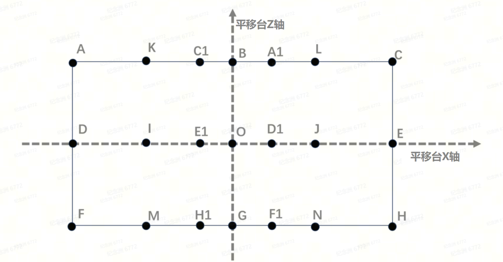
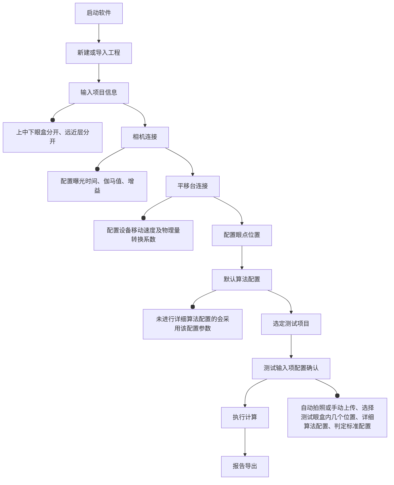
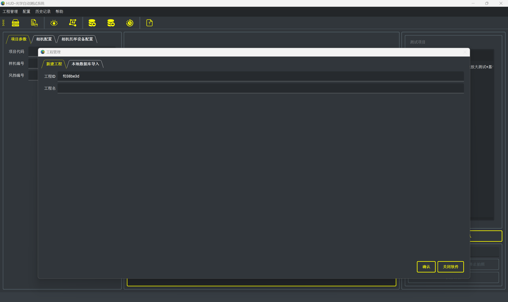
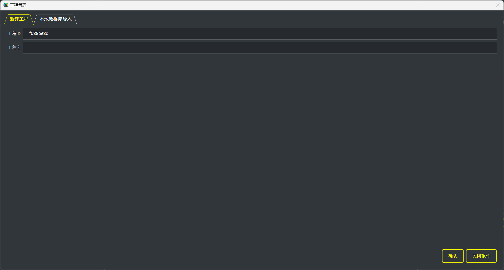
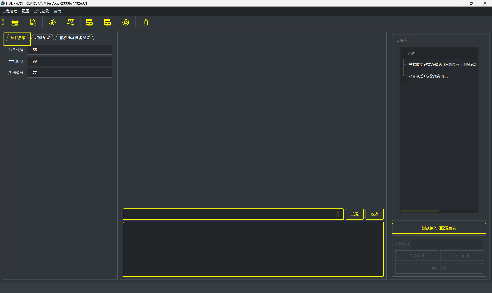
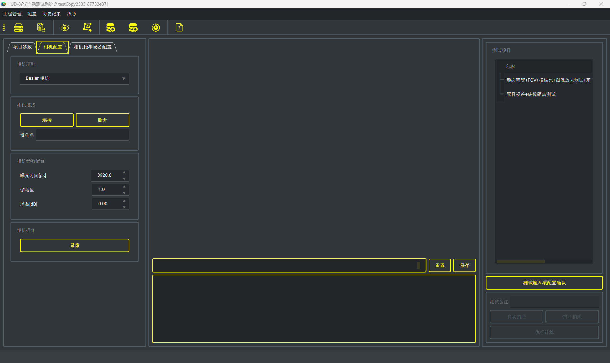
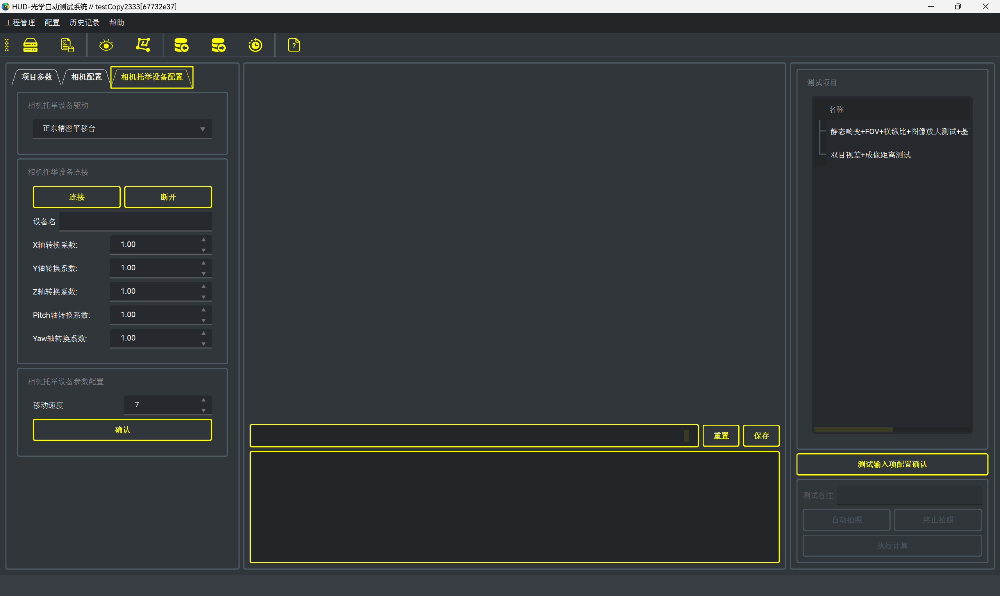
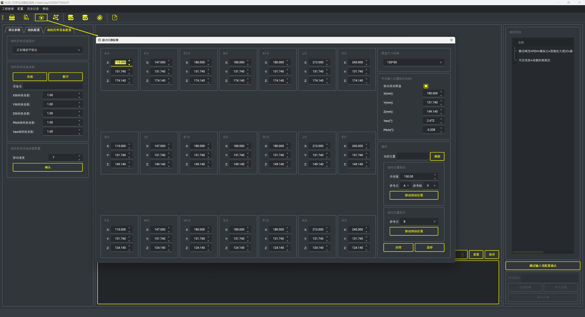

# 主要功能特性

## 工程管理

工程管理主要包括新建工程、导入工程、创建副本、删除工程、工程数据过滤等功能

## 测试眼点位置配置及平移台控制

测试眼点位置配置及平移台控制主要功能是根据项目需要，可配置如下眼点位置的x、y、z、yaw、picth值，配置后平移台可以移动到指定的眼点位置，同时该模块内置了130*50眼盒及100*30眼盒中各眼点的位置坐标联动关系。

测试眼点位置配置及平移台控制

 
 

 
 

眼点位置关系

| 点位 | 基准位置 | 相对位置 | 以130*50眼盒举例 | 以100*30眼盒举例 |
| --- | --- | --- | --- | --- |
| O | 基于平移台设定的绝对位置可作为配置项设定项包括X、Y、Z、偏航角、俯仰角 | / | X0 | X0 |
| ^ | ^ | ^ | Y0 | Y0 |
| ^ | ^ | ^ | Z0 | Z0 |
| A | / | 可作为勾选项以O点为基准的相对位置可作为配置项目设定项包括Y、Z | Y=Y0-65 | Y=Y0-50 |
| ^ | ^ | ^ | Z=Z0+25 | Z=Z0+15 |
| B | / | 可作为勾选项以O点为基准的相对位置可作为配置项目设定项包括Y、Z | Y=Y0 | Y=Y0 |
| ^ | ^ | ^ | Z=Z0+25 | Z=Z0+15 |
| C | / | 可作为勾选项以O点为基准的相对位置可作为配置项目设定项包括Y、Z | Y=Y0+65 | Y=Y0+50 |
| ^ | ^ | ^ | Z=Z0+25 | Z=Z0+15 |
| D | / | 可作为勾选项以O点为基准的相对位置可作为配置项目设定项包括Y、Z | Y=Y0-65 | Y=Y0-50 |
| ^ | ^ | ^ | Z=Z0 | Z=Z0 |
| E | / | 可作为勾选项以O点为基准的相对位置可作为配置项目设定项包括Y、Z | Y=Y0+65 | Y=Y0+50 |
| ^ | ^ | ^ | Z=Z0 | Z=Z0 |
| F | / | 可作为勾选项以O点为基准的相对位置可作为配置项目设定项包括Y、Z | Y=Y0-65 | Y=Y0-50 |
| ^ | ^ | ^ | Z=Z0-25 | Z=Z0-15 |
| G | / | 可作为勾选项以O点为基准的相对位置可作为配置项目设定项包括Y、Z | Y=Y0 | Y=Y0 |
| ^ | ^ | ^ | Z=Z0-25 | Z=Z0-15 |
| H | / | 可作为勾选项以O点为基准的相对位置可作为配置项目设定项包括Y、Z | Y=Y0+65 | Y=Y0+50 |
| ^ | ^ | ^ | Z=Z0-25 | Z=Z0-15 |
| K | / | 可作为勾选项以O点为基准的相对位置可作为配置项目设定项包括Y、Z | Y=Y0-33 | Y=Y0-33 |
| ^ | ^ | ^ | Z=Z0+25 | Z=Z0+15 |
| L | / | 可作为勾选项以O点为基准的相对位置可作为配置项目设定项包括Y、Z | Y=Y0+33 | Y=Y0+33 |
| ^ | ^ | ^ | Z=Z0+25 | Z=Z0+15 |
| I | / | 可作为勾选项以O点为基准的相对位置可作为配置项目设定项包括Y、Z | Y=Y0-33 | Y=Y0-33 |
| ^ | ^ | ^ | Z=Z0 | Z=Z0 |
| J | / | 可作为勾选项以O点为基准的相对位置可作为配置项目设定项包括Y、Z | Y=Y0+33 | Y=Y0+33 |
| ^ | ^ | ^ | Z=Z0 | Z=Z0 |
| M | / | 可作为勾选项以O点为基准的相对位置可作为配置项目设定项包括Y、Z | Y=Y0-33 | Y=Y0-33 |
| ^ | ^ | ^ | Z=Z0-25 | Z=Z0-15 |
| N | / | 可作为勾选项以O点为基准的相对位置可作为配置项目设定项包括Y、Z | Y=Y0+33 | Y=Y0+33 |
| ^ | ^ | ^ | Z=Z0-25 | Z=Z0-15 |
| A1 | / | 可作为勾选项以O点为基准的相对位置可作为配置项目设定项包括Y、Z | Y=Y0 | Y=Y0+16 |
| ^ | ^ | ^ | Z=Z0+25 | Z=Z0+15 |
| C1 | / | 可作为勾选项以O点为基准的相对位置可作为配置项目设定项包括Y、Z | Y=Y0 | Y=Y0-16 |
| ^ | ^ | ^ | Z=Z0+25 | Z=Z0+15 |
| D1 | / | 可作为勾选项以O点为基准的相对位置可作为配置项目设定项包括Y、Z | Y=Y0 | Y=Y0+16 |
| ^ | ^ | ^ | Z=Z0 | Z=Z0 |
| E1 | / | 可作为勾选项以O点为基准的相对位置可作为配置项目设定项包括Y、Z | Y=Y0 | Y=Y0-16 |
| ^ | ^ | ^ | Z=Z0 | Z=Z0 |
| F1 | / | 可作为勾选项以O点为基准的相对位置可作为配置项目设定项包括Y、Z | Y=Y0 | Y=Y0+16 |
| ^ | ^ | ^ | Z=Z0-25 | Z=Z0-15 |
| H1 | / | 可作为勾选项以O点为基准的相对位置可作为配置项目设定项包括Y、Z | Y=Y0 | Y=Y0-16 |
| ^ | ^ | ^ | Z=Z0-25 | Z=Z0-15 |
        

## 相机参数配置及拍照控制

相机参数配置及拍照控制主要包括相机的曝光时间、伽马值、增益参数配置，支持连续录像功能

## 光学测试项目自定义组合及配置

光学测试项目自定义组合及配置主要包括自定义组合测试项，支持双目视差+成像距离测试、静态畸变+FOV+横纵比+图像放大测试+基于静态畸变的动态畸变测试，选择测试项后进一步配置测试眼点，可以增加和删除，以及算法详细配置、报告导出标准配置、图像预览、图像重拍、图像导出等功能

## 平移台和相机自动控制及光学指标自动计算

平移台和相机自动控制及光学指标自动计算会自动化、连续的控制平移台移动到设定的眼点位置后控制相机自动拍照，全部眼点的照片拍摄完毕后，可以进行下一步的光学指标自动计算，全程不需要人介入。

## 运行历史记录及报告导出

运行历史记录会保存所有工程下的每次计算历史，具有报告导出、数据过滤等功能，提供数据回溯和查看能力

## 软件运行及配置数据库导出和导入

软件运行及配置数据库导出和导入功能提供所有工程数据、计算历史数据的导出和导入，提供跨设备的数据迁移能力。

# 软件安装

<video  controls>
<source src="HUD-光学自动测试系统操作说明文档.assets/软件安装说明.webm" type="video/mp4">
</video>

软件安装说明

 
 

# 软件操作流程及界面说明

## 软件操作流程

## 界面说明

### 新建或导入工程

软件启动后会弹出工程管理界面，如下图所示，必须新建或者导入工程后才能进行后续的操作

新建或导入工程

 
 

#### 新建工程

新建工程

 
 

设置工程名后点击确认

#### 导入工程

<video  controls>
<source src="HUD-光学自动测试系统操作说明文档.assets/导入工程.webm" type="video/mp4">
</video>

导入工程

 
 

选择工程进行导入、创建副本、删除工程、数据过滤操作

### 输入项目信息

输入项目信息

 
 

切换Tab页到项目参数，配置项目代码、样机编号、风挡编号

### 相机连接

相机连接

 
 

切换Tab页到相机配置，连接相机后会自动获取并填充设备名，点击录像，设置曝光时间、伽马值、增益

### 平移台连接

平移台连接

 
 

切换Tab页到相机配置，连接平移台后会自动获取并填充设备名，设置平移台各轴的移动速度，及设备系数[默认会自动根据设备进行配置，不需要手动选择， 不要随意修改，否则会影响移动位置的准确性]

### 配置眼点位置

配置眼点位置

 
 

### 默认算法配置

<video  controls>
<source src="HUD-光学自动测试系统操作说明文档.assets/默认算法配置.webm" type="video/mp4">
</video>

默认算法配置

 
 

配置完后点击保存即可

### 选定测试项目

<video  controls>
<source src="HUD-光学自动测试系统操作说明文档.assets/选定测试项目.webm" type="video/mp4">
</video>

选定测试项目

 
 

### 测试输入项配置确认

#### 图像配置：实时拍照

<video  controls>
<source src="HUD-光学自动测试系统操作说明文档.assets/实时拍照.webm" type="video/mp4">
</video>

实时拍照

 
 

#### 图像配置：手动上传

<video  controls>
<source src="HUD-光学自动测试系统操作说明文档.assets/手动上传.webm" type="video/mp4">
</video>

手动上传

 
 

### 执行计算

<video  controls>
<source src="HUD-光学自动测试系统操作说明文档.assets/执行计算.webm" type="video/mp4">
</video>

执行计算

 
 

### 报告导出【鼠标左键触发】

<video  controls>
<source src="HUD-光学自动测试系统操作说明文档.assets/报告导出.webm" type="video/mp4">
</video>

报告导出

 
 