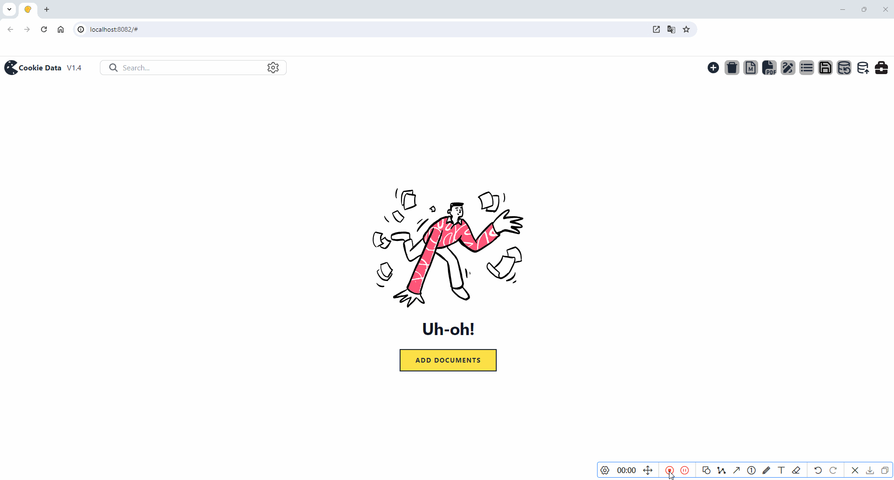
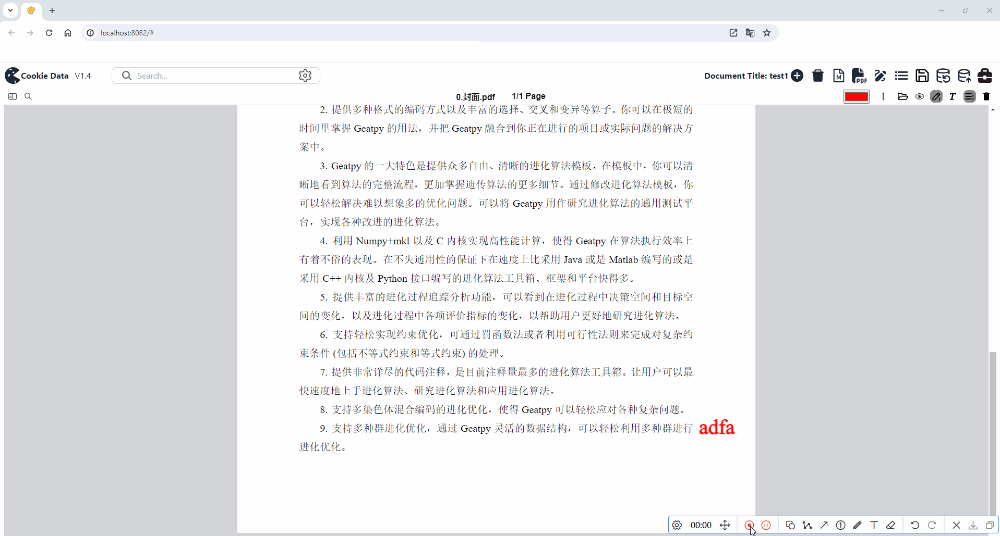
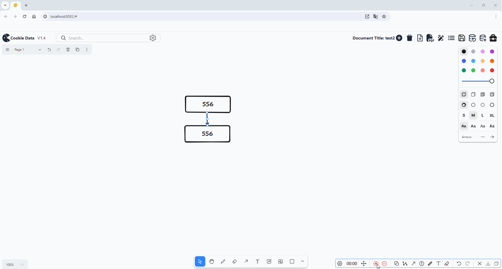
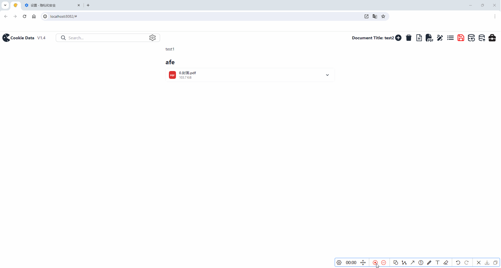

#  Temporary Data Collection Web App

This single-page web app is designed specifically for temporary data collection. It provides flexible tools to gather and manage different types of data, such as text, images, videos, and files, all within a web-based interface. The app relies solely on a static resource server powered by NGINX and does not have a dedicated backend. The primary features and tools include:

## Key Features

1. **Editor.js Integration** 📝
   Enjoy freeform editing and searching capabilities with the flexible Editor.js editor.
2. **PDF.js Integration** 📄
   Annotate and read PDF files directly within the application for a smooth document management experience.
3. **tldraw Integration** 📊
   Create flowcharts and diagrams effortlessly with the powerful tldraw tool.
4. **General Toolbox** 🛠️
   A suite of handy utilities to expand the app's functionality:
   - **ffmpeg.js Integration**
     Convert video formats using ffmpeg.js, making video handling more versatile.
   - **Whisper.cpp Integration**
     Convert video audio tracks into text quickly and efficiently via whisperCpp.
   - **Tesseract.js Integration**
     Recognize text in images using Tesseract.js for OCR.

## Technology Stack

- **Frontend**
  A seamless, responsive UI powered by React.
- **Static Resource Server**
  Static files are efficiently served through NGINX.

## Installation Guide

1. Download the release package.
2. Modify the `nginx_start.bat` file's path, replacing `cd E:\software\nginx-1.25.4` with the actual root path of your software.
3. Update the paths in `conf/nginx.conf` to match your real directories.
4. Right-click on the `nginx_start.bat` file to add it to the desktop. Double-click it to start the static resource server. 🚀

### Usage

1. Open your web browser and enter `http://localhost:8082/` to run the app.

## Demonstrations

### Text Editor

Watch how to edit text with the flexible Editor.js:

### PDF Reader

View and annotate PDFs directly in the app:

### Flowchart Drawing

Create flowcharts and diagrams using tldraw:

### Export and Import Resources

Learn how to export and import resources:

### Toolbox

#### Video Conversion

Convert videos to other formats with ffmpeg.js:

#### Audio Transcription

Transcribe speech to text using whisperCpp:

#### Optical Character Recognition

Extract text from images with Tesseract.js:

Feel free to customize and optimize the app to your needs! 🌟

