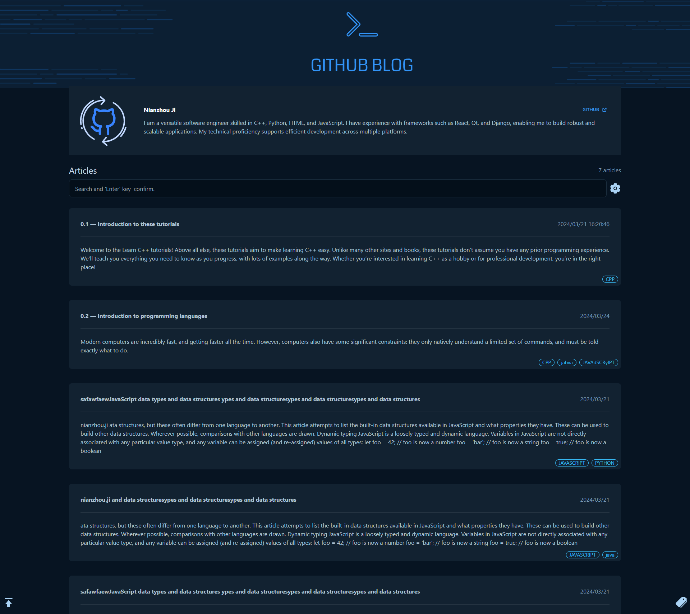
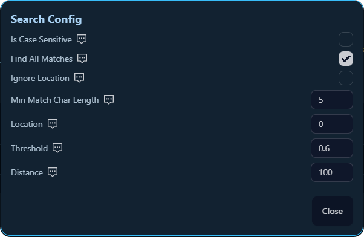
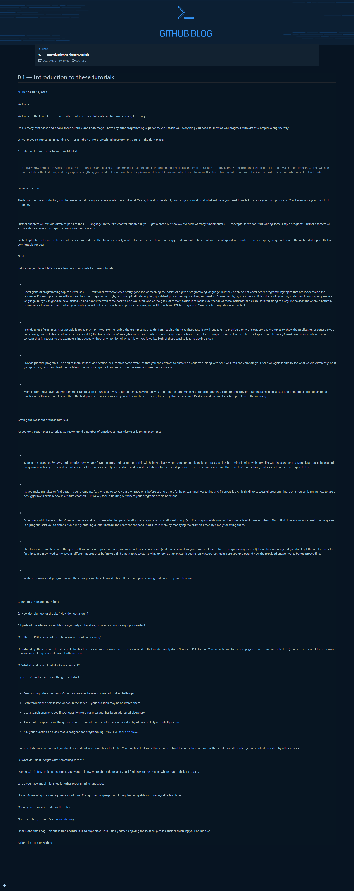
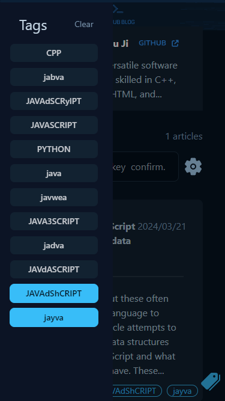

#  My Personal Blog Template

A clean, responsive GitHub Pages personal blog template that lets you quickly build an online personal blog system. This template, built with React, is designed for both desktop and mobile devices. It features a beautiful user interface and includes search and filtering functionalities. Follow the instructions below to start your own personal blog easily! 🌟

## Key Features

- **Beautiful Interface:** A clean and modern design that provides an excellent reading experience. ✨
- **Responsive Design:** Fully responsive for mobile and desktop devices. 📱💻
- **Search Capability:** Search for titles and article summaries. 🔍
- **Tag-Based Filtering:** Easily filter articles based on tags for more focused browsing. 🏷️

## Getting Started

### Prerequisites

- Node.js
- GitHub Pages enabled on your GitHub repository

### Configuration Guide

1. **`public/blogs/blogAssetsConfig.json`**: This file is for blog article configuration. The parameters are as follows:

   | Parameter | Type   | Description                                   |
   | --------- | ------ | --------------------------------------------- |
   | id        | string | Unique identifier                             |
   | name      | string | Article title                                 |
   | date      | string | Article creation date                         |
   | url       | string | Resource location relative to `public/blogs/` |
   | summary   | string | Article summary                               |
   | tags      | array  | Article tags, can have multiple               |

2. **`public/blogs/profileConfig.json`**: This file is for configuring your personal information displayed on the blog. The parameters are as follows:

   | Parameter   | Type   | Description                  |
   | ----------- | ------ | ---------------------------- |
   | name        | string | Personal name                |
   | description | string | Personal profile description |
   | GitHubUrl   | string | Personal website link        |

### Installation & Setup

1. **Fork and Clone the Repository:**

   ```
   git clone https://github.com/nianzhou-ji/github-blog-dev.git
   ```

2. **Install Dependencies:** Navigate to the project directory and install the required packages:

   ```
   npm install
   ```

3. **Configure Your Site:** Update `config.json` to customize your blog with your name, description, and other information.

4. **Run Locally:** To preview the blog locally before deploying, start the development server:

   ```
   npm start
   ```

   Access the blog at `http://localhost:3000`.

5. **Deploy to GitHub Pages:** Create a `<username>.github.io` repository, upload the built files to the repository, and access your blog at `https://<username>.github.io` to complete deployment!


## Demonstrations

- Main Interface



- Search Parameter Configuration Interface




- Reading Interface




- Tag Selection Interface



## License

This project is licensed under the MIT License - see the LICENSE file for details.

------

**Happy Blogging!** 🌟